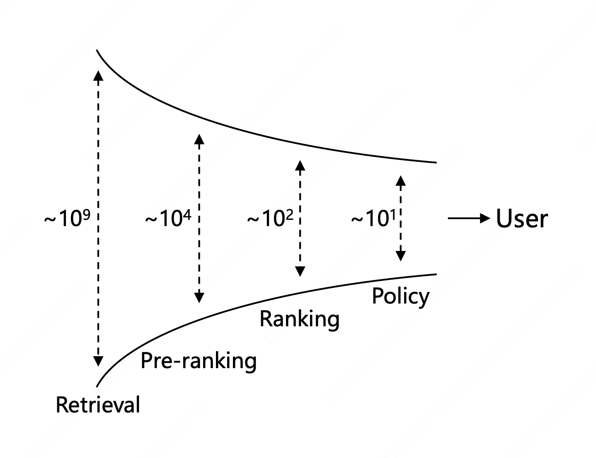
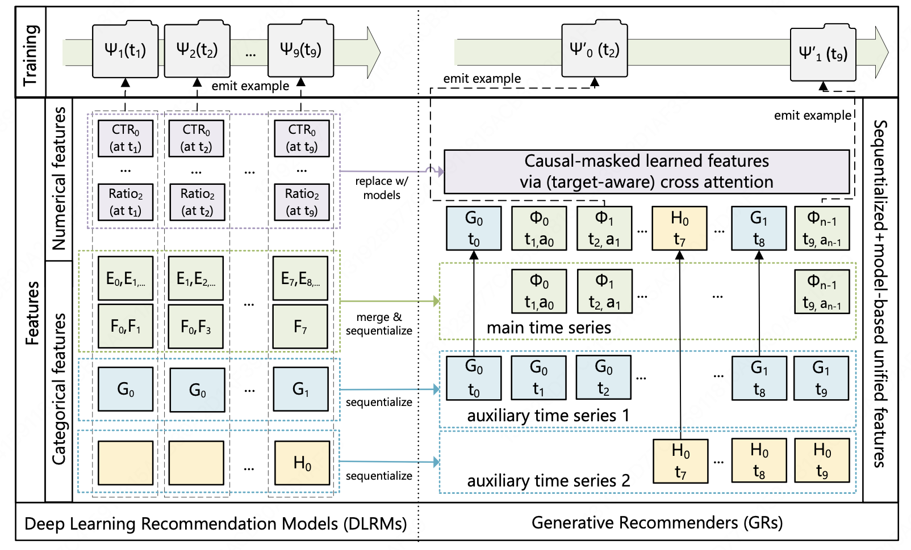
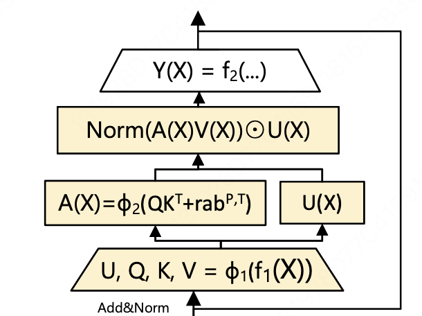
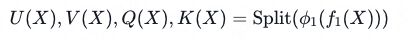
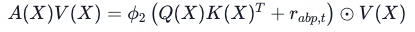
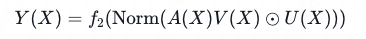
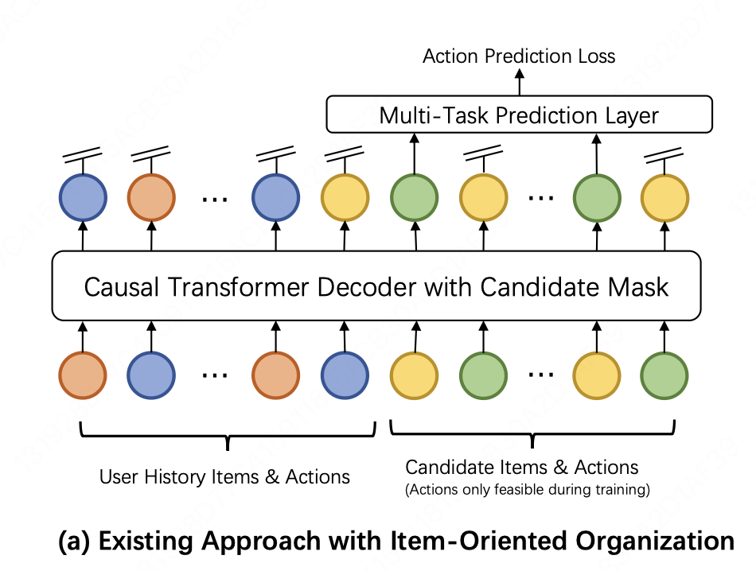
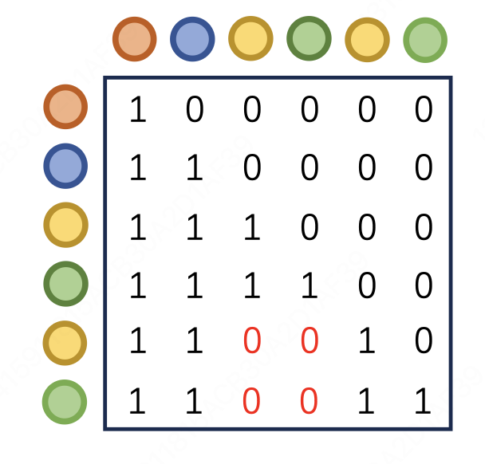
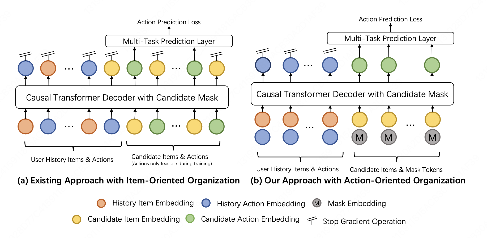

# GenRank论文分享--20251226
[toc]

## 1 论文背景
论文链接：[Towards Large-scale Generative Ranking](http://arxiv.org/pdf/2505.04180)

- **现有技术基础**：
  - **(传统方案)** 排序阶段主要采用MLP与Embedding范式。采用多层感知机和嵌入表示学习特征交互，虽然序列建模（SIM、DIN等）在捕捉用户兴趣方面有成效，但仍存在以下问题：特征工程计算开销大，限制了实时处理大规模候选集的能力；模型架构相对固定。
  - **(生成式推荐方案)** 将推荐问题重新定义为**序列生成任务**，直接从历史用户行为预测目标行为。虽然生成式推荐效果显著提升，但在**大规模工业场景**存在效率问题。
- **问题**：生成式推荐虽然技术新颖，但在工业级排序任务中的有效性和可行性仍未充分研究。
- **应用场景**：小红书“探索”页面的排序阶段（服务数亿用户，日均数百亿曝光）

**小红书“探索”页面**

**推荐系统（本文主要研究生成式推荐在Ranking阶段的应用）**

- **论文目标**：理解生成式排序的优势来源，并设计高效的工业级方案 GenRank，在加速训练和推理的同时，带来在线指标的提升。

## 2 实验设置
#### **实验描述**
- 论文研究**Ranking阶段的生成式排序**
- 系统需要对一组**预定义的任务**进行预测，例如预测用户看到候选项目时的**点击率**或者**停留时间**

#### **实验数据**
- 收集了15天内来自小红书"探索"页面的真实业务数据，共计**数百亿条**项目曝光日志。在线实验采用在线训练方式，回溯3个月的历史数据。

输入特征分为**三大类型**：

| **特征类型** | **具体内容** | **数据处理方式** |
|---|---|---|
| 分类特征 | 用户ID、物品ID、用户历史行为、标签等 | 通过 embedding 将类别转为向量 |
| 数值类型 | 用户年龄、项目发布时间、作者粉丝数等 | 使用预定义的边界值进行离散化（分桶），将数值型数据被转换成分类特征 |
| Frozen embeddings | Multi-modal item embeddings、Graph-based author embeddings | 使用预训练模型，作为先验知识 |

#### **实验评估**
- **评估方式**：使用**ROC 曲线下面积（AUC）**作为评估的指标
- **显著性阈值**：AUC 增加 0.001（0.10%）被认为是显著改进，因为通常能带来**0.5% 的 topline metrics 提升**

## 2.5 HSTU介绍
论文主要研究的生成式框架来自于另一篇论文提出的HSTU框架：

**论文标题**：Actions Speak Louder than Words: Trillion-Parameter Sequential Transducers for Generative Recommendations

**核心贡献**：用HSTU架构替代传统DLRM，实现万亿参数级别的生成式推荐系统

**HSTU实验效果（相比于传统的DLRM框架）**：
- 离线指标提升65.8%
- 在线A/B测试提升12.4%
- 推理速度提升2.99倍

#### **HSTU认为传统DLRM的瓶颈**
1. 特征工程复杂：数值特征、分类特征、嵌入等特征空间不同，需要设计多种模块，工程复杂度高，难以统一。
2. 可扩展性差。
3. 推荐系统缺乏统一范式：Ranking和Retrieval用不同架构，从而无法共享模型设计。同时，现有架构难以借鉴LLM的经验。

#### **HSTU与DLRM的框架对比**

**注：符号对照表**

| **符号** | **含义** | **出现位置** |
|---|---|---|
| **ψₖ(tⱼ)** | 在时刻tⱼ的第k个DLRM训练样本 | 左侧 |
| **ψ'ᵢ(tⱼ)** | 在时刻tⱼ的GR预测第i个输出 | 右侧 |
| **Φᵢ** | 第i个推荐物品/项目 | 右侧 |
| **tⱼ** | 时刻j（如t₀, t₁, t₂...t₉） | 两侧 |
| **aᵢ** | 用户对第i个物品的动作/反应 | 右侧 |
| **E, F, G, H** | 四种不同的分类特征维度 | 两侧 |
| **CTR** | 点击率（数值特征） | 左侧 |
| **Ratio** | 比率（数值特征） | 左侧 |
| **h** | 隐藏维度/嵌入维度 | 右侧 |
| **emit example** | 生成/发出一个训练样本 | 两侧 |

左侧表示传统DLRM框架，数据是由多个维度（左侧图中的E、F、G、H代表了四种不同纬度的特征）的异构特征按时间戳（左侧紫色块中t1,t2,t3对应的各个列）分别存储，每个时刻t~i~对应一组特征，不同类型的特征各自独立编码和交互，最终通过ψₖ(tⱼ)训练函数生成预测。

右侧表示新的HSTU框架，将所有异构特征统一合并和序列化后，转化为单一时间序列结构。图中展示了序列两种不同的类型：
1. 主时间序列（Main Time Series），代表物品序列，也就是实际训练和预测的结果序列。此处的组织形式是物品和用户反应的交错序列（Φ₀,a₀, Φ₁,a₁, Φ₂,a₂, ..., Φₙ₋₁,aₙ₋₁），其中Φᵢ代表第i个推荐给用户的物品/内容，aᵢ代表用户对Φᵢ的反应/动作。
2. 辅助时间序列（Auxiliary Time Series），代表来自原始分类特征的编码，参与训练和预测，但并非最终训练结果，图中序列1、2展示了两种不同的原始分类特征G、H。辅助时间序列的作用是补充主时间序列中缺少的分类特征信息，例如用户性别、年龄段、设备类型、地区等等。在计算交叉注意力时，主序列的每个位置都会对所有辅助序列位置进行注意力计算，以获得加权的辅助特征，参与到主序列的表示中。

右侧上方的**因果掩码学习特征（Causal-masked learned features）**用于确保确保预测时只能看到历史信息，每个位置只能注意前面的信息，保证单向依赖关系。

## 3 生成式推荐的有效性来源研究
### 3.1 HSTU中的关键机制
HSTU是首个生成式排序工作，采用Transformer Decoder架构。

#### HSTU**实验设置**

| **参数** | **设置** |
|---|---|
| **Transformer块数** | 3 **HSTU中Transformer块的创新**   从下往上依次是： 原始公式 功能   统一特征编码与多头表示生成   多头注意力聚合与动态特征交互  特征融合与最终表示生成 |
| **注意力头数** | 8 |
| **隐层维度** | 768 |
| **序列最大长度** | 480（项目和行为交错排列） |
| **硬件配置** | NVIDIA H20 GPUs + 混合精度训练 |

论文研究了生成式推荐与传统方法的两个核心差异：

**差异1：自回归序列交互方式**

| 对比内容 | **HSTU（Baseline）** | **对比实验** | **结论** |
|---|---|---|---|
| 损失计算 | 如下图所示，历史项（蓝色+红色的交错排列）不计算损失，仅计算候选项（黄色+绿色的交错排列）损失。    | 包含对历史项的损失计算 | 即使仅计算少量历史项的损失，也会导致AUC下降超过0.0100 |
| 注意力掩码 | 因果掩码：如图所示，对于每一个候选项（黄色+绿色的交错排列）计算注意力时，只能看到历史项和自身（掩码为1），不能看到其他候选项（掩码均为0）。    | 候选项之间完全可见 | 导致AUC下降>0.0015 |

得出结论：自回归方式对生成式推荐性能至关重要。移除自回归特性会导致显著的性能下降。

**差异2：训练样本组织方式**
HSTU的样本组织和传统方式不同，采用了分组的组织方式，用户在时间上相邻的行为分组为一个样本；而传统方式是逐点的，每个训练样本只对应一个曝光日志。

|  | **分组方式** | **逐点方式** |
|---|---|---|
| **样本组织** | 时间上相邻的行为成为一个样本（一组） | 一个曝光日志是一个样本 |
| **处理顺序** | Request1→Request2→... | Item1→Item2→Item3→Item4→... |
| **批次大小** | 根据分组大小可变(5,2,2...) | 固定(1,1,1...) |
| **特征共享** | 同Request共享 | 不共享 |
| **期望性能** | 基准 | 应该下降 |
| **实际性能** | 基准 | 几乎不变 |

论文假设这种分组的处理方式能够带来性能的提升，但在实际的对比实验中发现：使用**分组的组织方式来训练**，但每一组实际是按照逐点的方式进行（即每一个Request组只包含单个对应顺序的Item曝光日志），来模拟传统的训练方式，**性能仅略有下降**。

因此得出结论，影响HSTU系统性能的主要是**自回归的序列交互方式**，而不是分组的样本组织方式。

### 3.2 传统范式的模块在生成式推荐中的有效性
#### **研究背景**
传统DLRM系统中积累了多个经过验证的关键模块。本研究通过对照实验，验证这些模块在生成式推荐(GR)范式中的适用性和效果差异。

#### **实验设计**
选取工业排序系统中的4个代表性模块，分别在**传统DLRM范式**和**HSTU生成式范式**中应用，对比AUC指标的改进幅度。

| 模块名称 | 功能描述 | 应用场景 | 实验效果 |
|---|---|---|---|
| **SIM** | 序列建模，捕捉用户行为序列特征 | 捕捉用户行为序列特征 | 改进效果相当 |
| **PPNet** | 学习用户个性化表示 | 学习用户个性化表示 | 改进效果相当 |
| **内容嵌入** | 先验知识融入 | 引入内容侧信息 | **AUC提升达到2倍** |
| **PLE** | 处理多个学习目标 | 处理多个学习目标 | 改进效果相当 |

#### **实验结论**
**1. 大多数模块效果相当**
- SIM、PPNet、PLE等模块在两种范式中的改进效果基本一致
- 说明生成式范式并未削弱这些模块的有效性
- 验证了GR范式的兼容性和通用性

**2. 内容嵌入在生成式范式中表现优异**
- 在HSTU中，内容嵌入的AUC提升达到**2倍**
- 论文总结的原因：生成式范式的架构设计与内容嵌入的特点高度一致
    - 说明了生成式模型天然支持序列化特征表示
- 总结：**生成式范式对内容侧信息的利用能力更强**

### 3.3 特征工程在生成式推荐中的有效性
#### **核心问题**
生成式推荐的设计理念是：通过充分的序列建模和注意力机制，模型可以自动学习数据中的统计规律，因此**是否可以减少或移除手工特征工程**？

| 实验角度 | 实验结果 | **结论** |
|---|---|---|
| **大多数特征** | 移除后性能基本无损 | 对生成式架构**贡献甚微** |
| **关键特征** | 基于时间窗口的特征仍能改进性能 | 某些**实时统计特征**（尤其是基于时间窗口的特征）**仍然有效** |

#### **实验结论**
1. **生成式范式减少了特征工程的依赖**
    - 大多数传统特征可以移除，对性能作用不大，**模型能够通过序列建模自动学习这些信息。**
    - **特征工程的开销应当降低。**
2. **并非完全无需特征工程**
    - 实时统计特征仍然有效，需要保留能够显著改进性能的关键特征

## 4 GenRank架构设计
**核心创新一：架构组织**

图中展示了GenRank（右）和HSTU（左）在架构上的核心区别。

HSTU为了用一个统一的模型支持检索和排序两种任务，将用户兴趣（Item，红色）和用户行为（Action，蓝色）交错排列在序列中。这样的好处是，既可以预测用户兴趣（Item，黄色），用于从海量候选中检索出感兴趣的内容，又可以预测用户行为（Action，绿色），用于对候选内容进行精细排序。**但**这种设计会导致序列长度翻倍（从N增加到2N），从而大幅提高计算成本。

相比之下，GenRank则采用了不同的策略：它专注于行为预测，放弃了检索功能，将Item作为位置信息而非基本序列单位，仅保留Action序列进行预测。这样序列长度减半（从2N减少到N），使得注意力成本降低75%，线性投影成本降低50%，训练速度提升94.8%。虽然GenRank不支持检索任务，但在大规模排序场景中，它通过专一化设计实现了显著的效率提升，同时AUC性能还略有提升。

**输入表示设计：**
token_embedding = item_embedding + action_embedding + position_embedding + request_index_embedding

其中：
- Item Embedding：表示用户交互的项目
- Action Embedding：表示用户的行为（点击、停留等）
- Position Embedding：表示序列中的位置
- Request Index Embedding：表示请求批次

| **对比维度** | **HSTU** | **GenRank** |
|---|---|---|
| **设计目标** | 统一支持检索+排序 | 专注于排序优化 |
| **序列构成** | Item和动作交错 | 仅包含动作序列，Item作为位置信息 |
| **序列长度** | 2N（项目+动作） | N（仅动作） |
| **注意力成本** | 高 | **降低75%** |
| **线性投影成本** | 高 | **降低50%** |
| **训练速度** | 低 | **提升94.8%** |

**核心创新二：Position & Time Biases优化**
HSTU采用可学习的相对注意力偏置(Learnable Relative Attention Bias)来编码位置和时间信息。具体设计如下：

对于序列中的每个位置对(i, j)，计算相对位置偏置：
bias[i,j] = f(relative_position[i,j], relative_time[i,j])

其中：
- relative_position = j - i（位置差）
- relative_time = time[j] - time[i]（时间差）
- f(·)是可学习的函数

注意力计算：
attention_score[i,j] = (Q[i] · K[j]) / √d + bias[i,j]

因此对于长度为L的序列需要计算 L × L 个位置对，每个位置对需要查询偏置表，总共需要 O(L²) 次I/O操作。

而GenRank采用了**结构化的位置和时间偏置机制**，不为每个(i,j)对都学习一个独立的偏置，而是学习一个相对的偏置表。

GenRank的方案：bias[i,j] = position_bias[j-i] + time_bias[time[j]-time[i]]

其中：
- position_bias 是预先计算好的**相对位置的查询表**
- time_bias 是**时间差的查询表**，由于时间差范围很大，将连续的时间差离散化为"时间桶"，减少学习的参数。

两者可以预先计算和缓存，因此不需要再为每个(i,j)对计算偏置，可以预计算位置偏置表和时间偏置表，减少运行时的时间开销。

**消融实验分析**

| **组件** | **训练加速** | **AUC变化** | **说明** |
|---|---|---|---|
| 基准(HSTU) | - | - | - |
| +架构组织 | +78.7% | -0.0003 | 主要加速来源，AUC略降 |
| +位置&时间偏置 | +25.0% | +0.0009 | 补偿性改进，提升AUC |
| **GenRank(两者结合)** | **+94.8%** | **+0.0006** | **总体效果最优** |

**结论：** 架构组织是主要的加速来源（78.7%）。位置&时间偏置的改进不仅带来加速（25.0%），还补偿了的AUC下降。两者结合实现了加速和性能的平衡。

## 5 在线实验
### **实验设置**
#### **实验场景**
- **平台**：小红书“探索”页面
- **训练数据**：超过3个月的历史数据

#### **实验分组**
- **对照组**：随机抽取小红书用户的10%，使用baseline模型（小红书Explore Feed中实际部署的模型，采用传统的MLP & Embedding范式）
- **实验组**：随机抽取小红书用户的10%，使用GenRank模型
- **样本规模**：每组包含数千万用户
- **组间独立性**：两组用户之间无重叠

### **离线指标表现**

| **指标类型** | **主要任务** | **其他任务** |
|---|---|---|
| **AUC提升** | 超过 +0.0020 | 0.0005-0.0015 |
| **GAUC提升** | 超过 +0.0020 | 0.0005-0.0015 |

**注：主要任务的定义**

**主要任务**指的是直接影响小红书Explore Feed用户体验的关键指标，**具体任务类型论文未明确列举**。主要任务的AUC提升0.001就能带来在线指标0.5%的改进。

### **在线指标表现**
**以下为15天实验期间平均的在线A/B测试结果**

| **小红书在线A/B测试结果** |  |
|---|---|
| **指标** | **改进幅度** |
| **Time Spent**（用户花费时间） | **+0.3345%** |
| **Reads**（阅读数） | **+0.6325%** |
| **Engagements**（互动数） | **+1.2474%** |
| **LT7**（7天生命周期价值） | **+0.1481%** |

**全指标提升**：GenRank在所有在线指标上都优于baseline

**GenRank在冷启动项目上的改进特别显著**：论文认为这种改进来源于GenRank更好地利用预训练的知识

### **系统资源开销对比**

| **维度** | **GenRank** | **baseline** |
|---|---|---|
| **总体资源** | 相当 | 相当 |
| **训练成本** | 高 | 低 |
| **推理成本** | 低 | 高 |
| **存储成本** | 低 | 高 |
| **P99响应时间** | **提升超过25%** | — |

## 6 总结
文章的主要内容分为三部分：
1. **效果来源分析**
    - 通过理论和实验分析，发现生成式推荐的效果提升**主要来自架构设计**，而非训练数据的组织方式
    - 自回归方式和样本组织方式对性能的影响有限
2. **GenRank架构设计**
    - 提出**面向动作的序列组织**方式（替代面向项目的组织）
    - 设计高效的**位置和时间偏置**机制
    - 训练速度提升94.8%，同时保持性能
3. **验证**
    - 在小红书Explore Feed上进行大规模A/B测试
    - 用户满意度显著提升，推理延迟降低25%以上

### 对我们的启发：
1. **架构设计优先于训练范式**：GenRank通过改变序列组织方式（从项目中心到行为中心）获得78.7%的训练加速，这表明**架构创新带来收益往往高于参数调优**。
2. **选择性保留特征工程：** 生成式模型虽然减少了特征工程需求，但**实时统计特征仍能带来提升**。应有针对性地保留对整体效果有提升的特征。
3. **生成式框架兼容性：** 论文验证了SIM、PPNet、PLE等模块在生成式范式中的兼容性，说明**生成式架构可以与现有的有效模块组合**。
