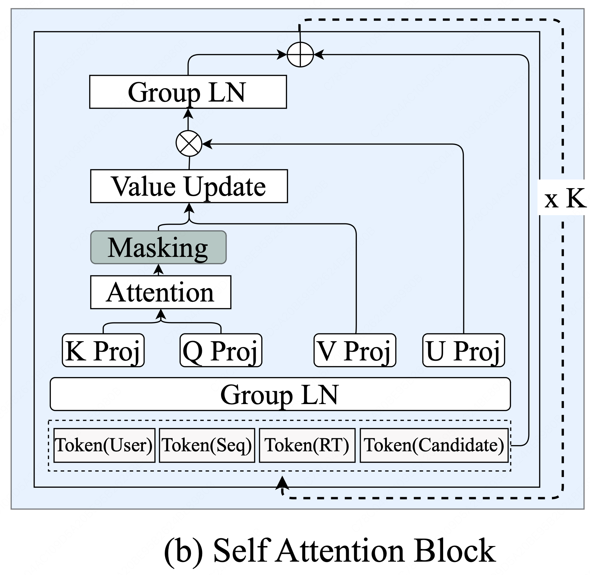
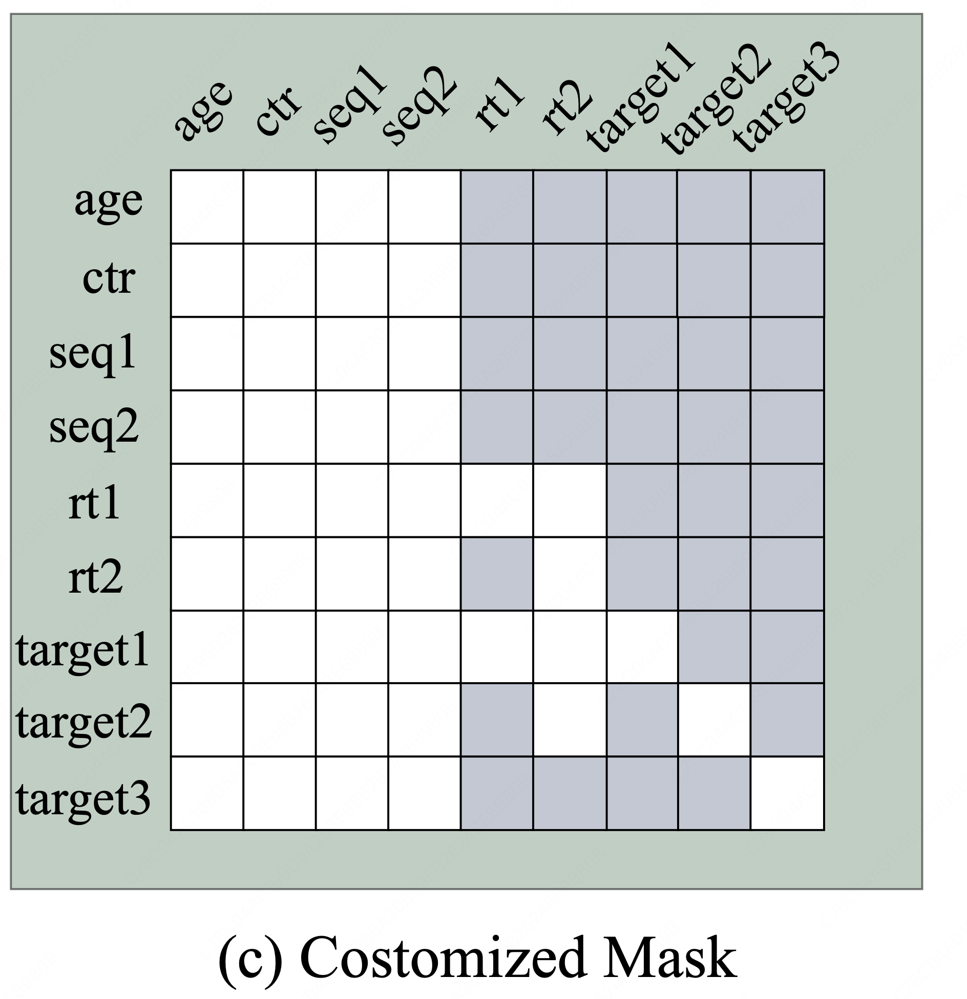
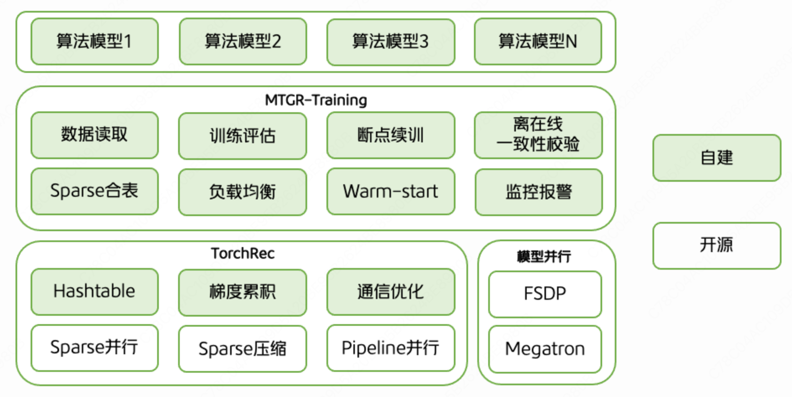
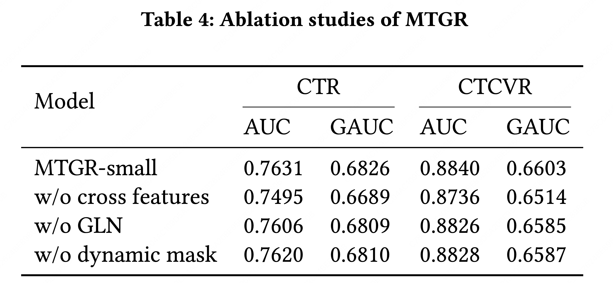

# MTGR: 美团工业级生成式推荐框架 

**论文链接：** [MTGR: Industrial-Scale Generative Recommendation Framework in Meituan](http://arxiv.org/pdf/2505.18654)

---

## 1. 背景

1. 美团外卖推荐场景经过近十年的面向交易目标的迭代，通过传统深度学习推荐系统进一步提升转化率变得十分困难。

2. Scaling Law 已经被多次验证其有效性，但在推荐系统的应用则仍处于起步阶段，前景大有可为。

### 1.1 已有技术基础

* **DLRM（深度学习推荐模型）**
    * **代表模型：** PLE、MoE、DCN、PEPNet 等（近十年工业界主流方案）。
    * **核心优势：** 依赖手动设计的交叉特征，能够很好地考虑不同特征之间的相互影响作用。
    * **扩展瓶颈：** 难以端到端处理超长用户行为序列，常依赖召回做截断；推理成本高昂，计算量与候选商品数呈线性增长。

* **GRM（生成式推荐模型）**
    * **代表模型：** HSTU、OneRec。
    * **核心优势：** 基于 Transformer/HSTU 架构，支持端到端长序列建模；遵循 Scaling Law，可通过增大参数量提高模型效果。
    * **扩展瓶颈：** 早期尝试基于“预测下一个 token”的范式，舍弃了交叉特征，导致结果下跌，且无法通过扩大模型规模来弥补。

**消融实验数据（移除交叉特征的影响）：**

| model | CTR_GAUC | CTCVR_GAUC |
| :--- | :--- | :--- |
| **MTGR-small wo 交叉特征** | **-1.25pp** | **-0.91pp** |

---

## 2. 论点

### 2.1 传统 DLRM 流程（输入建模）

在 DLRM 中，对于某个用户 $U$ 和对应的 $K$ 个候选物品，用户的第 $i$ 个候选物品样本包含五类特征：
$$(U, S, R, C_i, I_i)$$

* $U$：用户特征（标量）。
* $S$：用户历史感兴趣的物品序列。
* $R$：最近几个小时或者最近一天交互的物品序列（实时兴趣）。
* $C_i$：用户和候选集的交叉特征（如用户在物品标签上的统计特征）。
* $I_i$：候选集的特征。

**处理流程：**
1.  分别处理 $U$、$C$、$I$。
2.  对序列 $S$ 和 $R$ 进行 Embedding 并 Concat。
3.  Target Attention：使用目标物品 $I$ 作为 Query 聚合历史行为 $S$。
4.  拼接所有特征：$concat(U, \text{Pooling}(S), \text{Pooling}(R), C, I)$ 经 MLP 输出 Logit。

### 2.2 MTGR 数据重排与体系结构

MTGR 将第 $i$ 个样本特征重组为：$(U, S, R, (C_i, I_i))$。

**主要差异与优势：**
1.  **交叉特征融合** 将交叉特征 $C$ 作为候选物品特征的一部分（兼容 PNN 等网络得到的交叉特征）。
2.  **用户聚合**
    * 在特定时间窗口内，将用户的所有候选集聚合在一条样本中。
    * **优势：** 用户的特征 ($U, S, R$) 只需要计算一次。
    * **训练收益：** 样本量从“候选物品总量级”降至“用户总量级”。
    * **推理收益：** 推理时间和候选集数量解耦，实现亚线性增长，支持万亿参数模型部署。

### 2.3 Token 化规则

MTGR 将所有的特征和序列都转化为 Token 序列：

* **标量特征 $U$：** 每个特征转化为独立的 token。
* **序列特征 ($S/R$)：** 每个历史物品嵌入后 concat，经 MLP 映射为一个 token。
* **候选与交叉特征 ($C, I$)：** 物品特征嵌入后 concat，经 MLP 映射为一个 token。
* **最终输入：** 将上述所有 token 拼接成一个长序列。

### 2.4 MTGR 对 HSTU 的优化

采用类似 HSTU 的堆叠自注意力层与纯编码器结构，主要优化如下：

1.  **分层处理与去 Softmax：**
    * **GLN (Group Layer Norm)：** 按特征分类分组归一化，实现不同语义空间 Token 对齐。
    * **SiLU 激活：** 利用 $Q, K$ 计算注意力分数后，采用 **SiLU** 替代 Softmax。避免长序列下的“注意力稀释”，保留用户行为强弱的绝对信号。
    * **门控聚合：** 使用投影后的 $U$ 门控信号与更新后的 $V$ 做点积。

2.  **动态掩码 (Dynamic Mask)：**
    由于R记录的是用户最近的交互行为，其时间可能与样本聚合窗口重叠，使用简单的因果掩码可能会导致信息泄露。因此MTGR对不同类型的序列采用不同的注意力机制：

    a. 对静态序列使用全注意力：静态序列对所有token可见

    b. 对动态序列使用自回归注意力和动态掩码：每个token仅可见于其之后出现的 token；

    c. 对候选项之间使用对角掩码：候选token(C和I)只能看到自己；

图2(c)给了一个例子，图3给出了一般规则，标有颜色表示可以被看见，每一行表示该Token可以看到哪些Token，每一列表示该Token可以被哪些Token看到。

---

## 3. 训练与推理优化

### 3.1 挑战
相比传统DLRM模型，GR模型的训练和推理面临严峻挑战：

训练数据和稠密网络参数规模scale导致离线训练计算量激增：按照Scaling Law的指导，模型效果的提升来自训练数据量和模型参数量的增加，带来训练计算量的大幅增加。

稀疏Embedding规模scale导致离线训练存储规模激增：新模型范式引入更多的样本和特征，导致Embedding数据量大幅膨胀，给Embedding的分布式存储和通信带来严峻的性能挑战。

在线推理模型规模和计算量伴随模型scale激增：模型大小和计算量膨胀显著，需要更强算力、更大显存的GPU加速卡，或者考虑CPU-GPU联合推理的异构计算模式。

为了解决上述问题，美团技术团队建设了MTGR模型训推引擎，解决模型计算量和存储量激增带来的诸多性能挑战。包含两个核心组件：

MTGR-Training：支持低成本、高效率大规模分布式训练。

MTGR-Inference：支持低延迟、高吞吐大规模线上推理部署。

### 3.2 解决方案

**MTGR-Training (大规模分布式训练)：**
1.  **动态 Hash 表：** TorchRec使用固定大小的表来处理稀疏嵌入，所以静态表通常需要预分配超过实际需求的容量，以防止 ID 溢出，从而造成内存浪费。
为此实现了一个基于哈希的高性能嵌入表，可以在训练过程中动态为稀疏ID分配空间。该哈希表采用解耦架构，将 key 和 value 的存储分离，通过紧凑的内存布局存储 key，提高 key 扫描效率，仅复制轻量的 key 结构即可实现容量扩展。
2.  **Kernel 优化：** 借鉴flash-attention的思想重新实现了HSTU kernel，优化GPU的内存IO效率，支持变长序列的输入提升了Attention的计算效率，单算子性能相较于Triton版本提升2到3倍。
3.  **负载均衡：** 在推荐系统中，用户行为序列通常呈现长尾分布，少数用户有较长序列，如果采用固定批大小训练时会导致计算负载严重不均衡。引入动态batchsize，每张 GPU 的本地批大小会根据输入数据的实际序列长度动态调整，确保各 GPU 的计算负载大致相同。同时调整了梯度聚合策略：根据各 GPU 的批大小对其梯度加权，从而保持与固定批大小一致的计算逻辑。

**MTGR-Inference (高性能推理)：**
基于Nvidia软件生态，美团技术团队构建了高性能的GR模型推理引擎MTGR-Inference：
* **选择TensorRT作为模型推理框架** TensorRT是Nvidia推出的推理优化框架，在业界广泛应用，具有较强的算子融合、低精度量化能力。
* **选择Triton Inference Server作为模型部署框架** Triton Inference Server是Nvidia推出的高性能模型部署框架，在业界广泛应用，是TensorRT官方推荐的模型部署方案。

---

## 4. 实验结果

### 4.1 数据集
离线实验中使用美团真实场景10天数据，包含交叉特征，如表1所示；在线实验中为了与已经训练了超过两年的DLRM基线模型进行对比，构建了一个超过 6 个月的数据集。

### 4.2 模型参数

* **DLRM：** Batch 2400 (per GPU), 8张 A100。
* **MTGR：** Batch 96, 16张 A100。静态序列长度 1000，动态序列长度 100。
如表 2 所示，随着模型复杂度的增加，学习率相应降低。同时，随着模型规模增长，稀疏参数的维度也会按比例放大。

### 4.3 结果分析

#### 总体性能分析
如表3所示，其中SIM方法基于序列召回，E2E方法基于原始长序列。
a. UserTower-E2E 的表现略有下降，推测是因为在DLRM框架下，模型复杂度不足以建模完整的序列信息导致出现欠拟合。
b. MTGR 模型，即使是最小版本，也优于最强的 DLRM 模型，且随着模型复杂度的增加，其性能也平滑提升。

#### 对交叉特征、GLN和动态掩码的消融实验
a. 去除任意一个组件都会导致模型性能明显下降；
b. 移除交叉特征后，模型的各项性能指标出现了显著下降，甚至抵消了 MTGR-large 相较于 DLRM 所带来的性能提升；

#### Scaling law的验证

图6(abc)随着HSTU 块的数量、模型维度（model）以及输入序列长度的增加，模型指标逐步提升。

图6(d)展示了模型性能与计算复杂度之间的幂律关系。纵轴表示相对于最佳 DLRM 模型 UserTower-SIM在CTCVR GAUC指标上的提升幅度，而横轴则表示 与 UserTower-SIM 相比的计算复杂度的对数倍数。

#### 在线实验

对比基线模型是当前线上效果最好已连续学习了两年的UserTower-SIM， MTGR 模型使用过去6个月的数据进行训练部署到线上进行对比。

如表5所示，无论是离线还是在线的MTGR指标都表现出良好的可扩展性。

MTGR 模型已在美团外卖的业务场景中全面上线。它的训练成本与 DLRM 相当，推理成本则降低了 12%。在 DLRM 中，推理成本大致与候选物数量线性增长，而 MTGR 利用了用户聚合机制，在一次请求中对所有候选项共享用户表示，使得推理成本随候选数呈亚线性增长，从而有效降低了线上推理的开销。

| 实验设置 | 计算复杂度 (GFLOPs) | 离线 CTR_GAUC | 离线 CTCVR_GAUC | 在线 PV_CTR | 在线 UV_CTCVR |
| :--- | :--- | :--- | :--- | :--- | :--- |
| **DLRM base** | - | 0.86 | - | - | - |
| **MTGR-small** | 5.47 | **+0.36pp** | **+1.54pp** | **+1.04%** | **+0.04%** |
| **MTGR-middle** | 18.59 | **+0.71pp** | **+1.82pp** | **+2.29%** | **+0.62%** |
| **MTGR-large** | 55.76 | **+1.53pp** | **+2.88pp** | **+1.90%** | **+1.02%** |

---

## 5. 总结与启发

### 5.1 核心创新
1.  **生成式架构与 DLRM 特征的深度融合** MTGR 本质上是利用生成式模型的大容量来处理推荐任务，同时保留了传统 DLRM 在工业界验证过的强特征工程优势。
2.  **架构创新：** 利用 HSTU 高效处理用户万级历史行为序列，捕捉隐式长期兴趣。

去 Softmax 设计：改用 SiLU 激活函数计算注意力，避免长序列下的“注意力稀释”，保留了用户行为强弱的绝对信号。

针对推荐场景中 User、Item、Context 等特征域分布差异大的问题，采用分组归一化（Group Norm）替代全局 LayerNorm。

统一了召回与精排范式，显著提升了对长尾商品和用户长期兴趣的挖掘能力。

### 5.2 局限性
* **资源消耗：** 虽然推理优化了，但训练资源消耗（显存、算力）依然远高于DLRM。
* **冷启动：** 对无行为的新用户/新物品，序列优势发挥不出来，DLRM靠属性泛化可能更好。
* **全量ID依赖** 严重依赖ID Embedding，对新ID不够友好。
 
### 5.3 业务启发
不适用于SUG场景，Transformer 架构，虽然有HSTU加速，但相比传统的多塔模型，推理还是很重。

可以尝试用于底纹词或猜搜（延时容忍度较高的场景），容易拿到 MTGR 长序列建模的收益

---

### 参考文献
1.  Tang H, et al. Progressive layered extraction (ple). RecSys 2020.
2.  Jacobs R A, et al. Adaptive mixtures of local experts. 1991.
3.  Wang R, et al. Dcn v2. The Web Conference 2021.
4.  Chang J, et al. Pepnet. KDD 2023.