# OneTrans分享-20251205

论文名称：《OneTrans: Unified Feature Interaction and Sequence Modeling with One Transformer in Industrial Recommender》

公司：字节跳动

论文链接：[https://arxiv.org/pdf/2510.26104](https://arxiv.org/pdf/2510.26104)

应用场景：tiktok首页信息流&电商

## 0 背景

序列建模（LONGER）和特征交叉（Wukong, RankMixer）都取得进展，但是存在两点问题：

其一，“先编码后交互”的流水线架构限制了双向信息流的传递，从而削弱了静态特征与场景上下文特征对序列表征的塑造作用；

其二，模块的分离式设计会割裂执行流程并增加延迟，而单一的Transformer式架构网络则可复用大型语言模型的各类优化手段（如键值缓存、快速注意力机制（FlashAttention）、混合精度训练等），进而实现更高效的规模扩展。

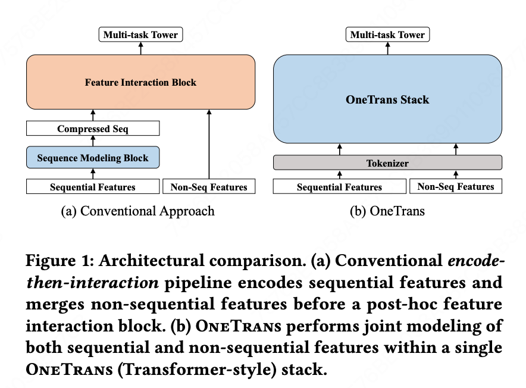
**OneTrans**提出统一的因果Transformer架构网络，打破了序列特征与非序列特征之间的架构壁垒，可同时完成用户行为序列建模与特征交互两大任务。

## 1 方法
### 整体架构

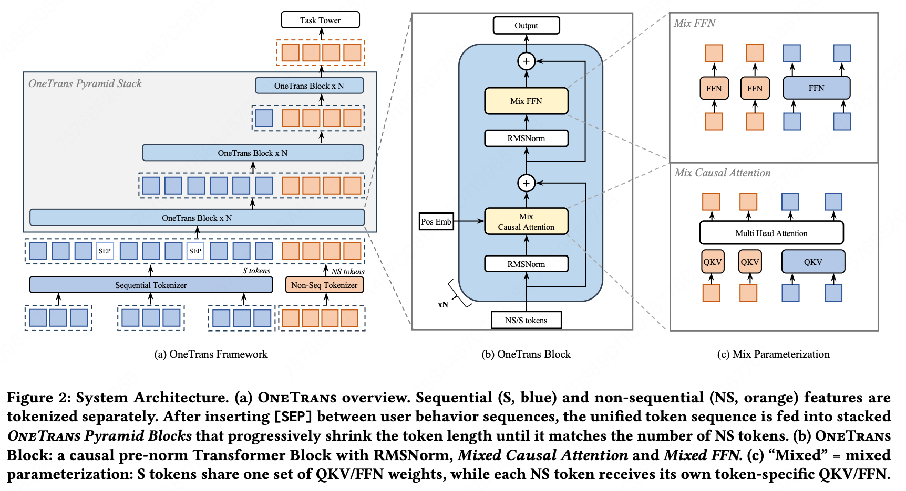
### 1.1 Features and Tokenization

**特征预处理流程：**
1. **行为序列特征子集->S-tokens**  
多行为序列，每条序列$S_{i}$由$L_{i}$个事件嵌入向量e组成，这些事件嵌入向量是通过将物品标识（ID）与其对应的辅助信息（如物品类别、价格）拼接而成的：  
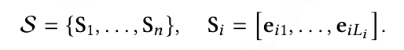
merge多行为序列的方法有两种：  
    1. **Timestamp-aware**：按时间顺序交错排列所有行为类型序列，并添加行为类型标记  
    2. **Timestamp-agnostic**：依据事件影响程度（比如下单>加购>点击）拼接各序列，同时在序列之间插入可学习的分隔token（[SEP]）  
最终序列token表示如下，其中$\tilde{S}_{i}$有$S_{i}$经过共享mlp映射得到  
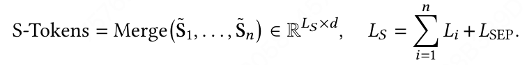

2. **非序列特征子集->NS-tokens**  
包括用于表征用户、物品或场景上下文特征，由于可能涉及到数百种重要性各异的特征，需要控制NS-tokens的数量，这里有两种方式：  
    1. **Group-wise Tokenizer**：先人工语义划分+mlp  
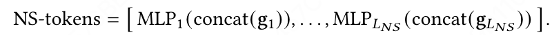
    2. **Auto-Split Tokenizer**：concat后mlp + 自动分组  
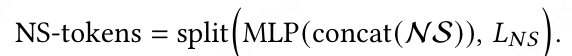

最终生成$L_{NS}$个非序列token，每个token的维度均为d。

最终模型输入为：  
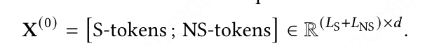

### 1.2 OnTrans Block

每一个都是由应用于归一化token序列（S-token+NS-token）的因果transformer和FFN组成，考虑到特征异构性：  
1. transformer和FFN均采用混合参数策略：同质的S-tokens共享一套参数；而因来源/语义不同具有异构性的NS-tokens，则各自配备token专属的参数  
2. RMSNorm作为前置归一化，对齐不同token类型的尺度  

#### 1.2.1 Mixed (shared/token-specific) Causal Attention[^1]

token -> QKV:  
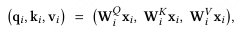

混合参数化策略：  
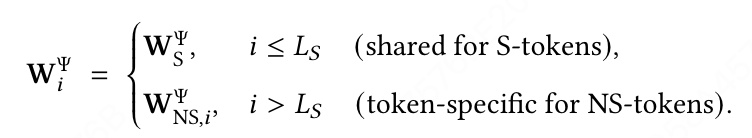

因果掩码处理，且非序列token（NS-tokens）置于序列token（S-tokens）之后的好处：  
1. **序列侧效果**：每个序列token仅能关注其之前的序列位置。对于基于时间戳的序列而言，每个事件均依赖于自身的历史行为；对于与时间戳无关的序列（按用户意图排序，例如：下单→加购→点击/曝光），因果掩码可使高意图行为的信号为后续低意图行为提供参考并进行筛选。  
2. **非序列侧效果**：每个非序列token既能关注**完整的序列历史信息**，实现对序列特征的目标注意力聚合，又能关注其之前的非序列token，从而提升token层面交互的多样性。  
3. **金字塔策略适配性**：无论是序列侧还是非序列侧，因果掩码都会逐步将信息向靠后的位置集中，这一特性天然适配逐层裁剪token的金字塔策略，具体细节将在后文详述。  

#### 1.2.2 Mixed (shared/token-specific) FFN

当$i ≤L_{S}$时采用参数共享模式，当$i>L_{S}$时每个token参数专属。  
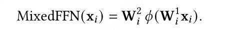
### 1.3 Pyramid Stack

因果掩码会将信息向靠后的位置集中，借助causal masking的结构，采用了金字塔策略：在每个OneTrans模块层中，仅选取最新的一部分序列token（S-tokens）来生成查询向量，而Key向量/Value向量仍基于完整序列计算；Query向量集合的规模会随网络深度的增加而逐步缩小。  

### 1.4 训练和部署优化
#### 1.4.1 Cross Request KV Caching

S-tokens在所有候选物品中保持一致，NS-tokens则会随候选物品的不同而变化，针对这一特性，产生统一的两阶段范式：  

stage1：序列侧，对所有S-tokens执行因果掩码处理，缓存Key-Value Pair，单次请求执行一次；  

stage2：非序列侧，针对每个候选物品，计算NS-tokens，并基于缓存的序列侧Key-Value Pair执行交叉注意力计算，随后FFN。  

**跨请求场景**：由于用户行为序列为追加写入模式，我们将KV Caching的适用范围扩展至跨请求场景：每一次新请求都会复用前一次的缓存结果，仅需针对新增行为计算增量键值对。计算复杂度从$O(L)$降至$O(\Delta L)$，其中$O(\Delta L)$代表自上次请求以来新增的行为数量。  

#### 1.4.2 Unified LLM Optimizations
1. **FlashAttention-2算法**：通过分块计算和kernel fusion[^2]，在训练与推理阶段均实现了内存占用降低与吞吐量提升。  
2. **混合精度训练（BF16/FP16）**。  
3. **激活值重计算**：缓解GPU计算压力，计算梯度的两种模式：前向模式（forward-mode）和反向模式（reverse-mode）。反向模式需要存储前向传播中的所有中间激活值（activations），这些激活值可能会占用大量内存。为了减少内存占用，作者采用了重计算策略：在前向传播中丢弃部分激活值，在反向传播中重新计算这些值。这种策略通过增加计算量来换取内存节省，从而在有限的GPU内存下训练更大的模型。  

## 2 实验

主要研究5个问题：  
1. **统一堆叠架构 vs. 先编码后交互架构的性能对比**  
2. **消融实验**  
3. **系统效率优化效果**  
4. **Scaling-Law**  
5. **线上 A/B 测试效果**  

文章设定了两种模型配置：  
- **OneTransS**：采用6个堆叠的OneTrans块，模型维度d=256，注意力头数H=4，目标参数规模约为1亿。  
- **OneTransL**：则扩展至8层，模型维度提升至d=384（注意力头数保持H=4不变）。  

token处理方式为：  
- 多行为序列采用时间戳感知的方式进行融合。  
- 非序列特征则通过自动拆分法完成token化。金字塔调度策略将token数量从1190个线性缩减至12个。  

**模型超参数设置**  
- 优化器策略--**无权重衰减的双优化器策略**  
    - 稀疏嵌入参数采用Adagrad优化器进行训练（参数设置为$\beta_{1}=0.1$，$\beta_{2}=1.0$）。  
    - 稠密参数则采用RMSPropV2优化器（学习率$lr=0.005$，动量参数momentum=0.99999）。  
- 单块GPU的批次大小设置为2048，在线推理时调整为100。  
- 设置梯度裁剪阈值：稠密层梯度裁剪阈值为90，稀疏层梯度裁剪阈值为120。  
- 模型训练基于16块H100 GPU。  

### 研究问题1：统一堆叠架构 vs. 先编码后交互架构的性能对比

主要探讨计算量相当的前提下，单一Transformer堆叠架构能否带来稳定的性能提升（以下指标提升**0.1%以上**即被视为具有实际业务价值；而提升**0.3%以上**时通常能在后续的线上A/B测试中体现出统计显著性效果）。  

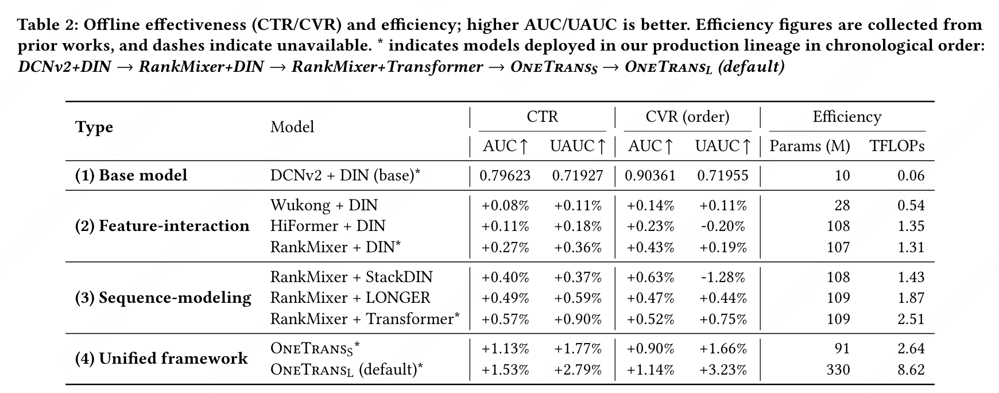

结论：  
1. 在**先编码后交互**的范式下，单独对任一模块进行规模扩展均能带来收益：无论是升级特征交互模块（DCNv2→悟空模型→HiFormer→排序混合器），还是替换序列建模模块（堆叠式深度兴趣网络→Transformer→LONGER）。  
2. OneTrans VS baseline效果大幅提升。  
3. OneTrans vs **RankMixer+Transformer**：参数规模相当、训练浮点运算量相近，统一建模更优越。  
4. **OneTransL vs OneTransS**：随着模型容量的增加，性能表现增长。  

### 研究问题2：消融实验

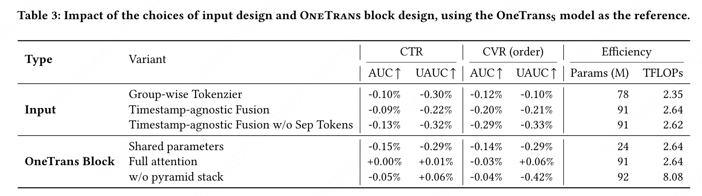

结论：  

针对输入变体：  
1. 采用分组token方式替代自动拆分token方式（第1行）：让模型自动构建非序列特征token，比依赖人工定义的特征分组方式更为高效。  
2. 采用与时间戳无关的融合策略，替换时间戳感知的序列融合策略（第2行）：时间戳感知融合策略的效果优于基于意图的排序策略。  
3. 在时间戳感知的序列融合流程中移除分隔token（[SEP]）（第3行）：可学习的分隔token（[SEP]）有助于模型区分不同的序列。  

针对OneTrans块变体：  
1. 所有token共享一套Q/K/V与FFN参数，不再为NS-tokens分配独立参数（第4行）：个性化映射的方式对非序列特征进行建模，可实现更优的特征区分效果。  
2. 采用全注意力机制替代因果注意力机制（第5行）：在此任务设定下，允许token关注后续位置的操作并非关键因素。但全注意力机制会限制KV caching等标准优化策略的应用。  
3. 所有网络层均保留完整token序列，去掉金字塔堆叠功能（第6行）：在所有网络层中保留完整token序列并无增益，金字塔设计能够安全地裁剪查询向量，以节省计算开销。  

### 研究问题3：系统效率优化效果

主要研究金字塔堆叠、跨请求键值缓存、FlashAttention-2、混合精度结合激活重计算这四项优化策略能否有效降低浮点运算量、内存占用与推理延迟。  

基于**OneTransS**：未经优化的**OneTrans**模型训练耗时为407毫秒，训练峰值内存占用53.13 GB；推理场景下的99分位延迟为54.00毫秒，推理内存占用1.70 GB。  

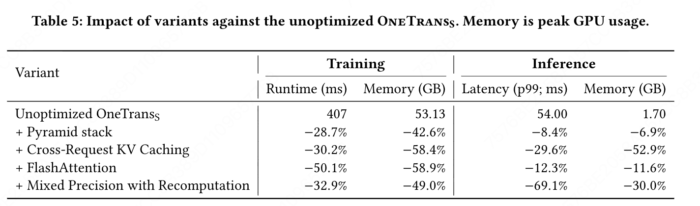 

### 研究问题4：Scaling-Law

（1）**长度维度**——输入token序列的长度。  
（2）**深度维度**——堆叠网络块的数量。  
（3）**宽度维度**——隐藏状态的维度。  

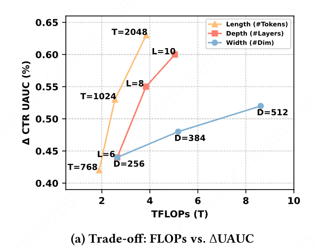
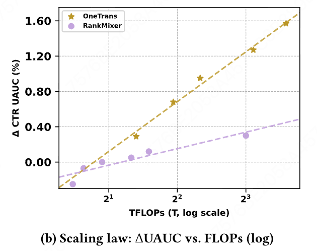
结论：  
1. **增加序列长度 > 增加深度 > 增加宽度**，但更深的模型也会增加串行计算的开销，而增加宽度则更利于并行化处理。  
2. OneTrans > RankMixer。  

### 研究问题5：线上 A/B 测试效果

**应用场景：首页信息流+电商场景**  

线上基线模型**RankMixer+Transformer**作为对照组，实验组则部署了**OneTransL**模型。  

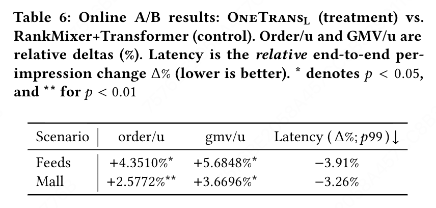

此外，用户活跃天数提升了0.7478%，冷启动商品的人均订单量实现了13.59%的显著增长。  

## 3 总结

1. **统一化框架**。提出了适用于排序任务的单一Transformer骨干网络模型OneTrans，该模型配备统一分词器，可将序列特征与非序列特征编码为单一token序列；同时搭载统一Transformer模块，能够同步完成序列建模与特征交互任务。  
2. **面向推荐系统的定制化设计**。为了弥合大型语言模型与推荐系统任务之间的差异，OneTrans采用混合参数化策略：为多样的非序列token分配专属的token参数，同时让所有序列token共享同一套参数。  
3. **高效的训练与部署能力**。一是采用金字塔策略，对序列token进行渐进式剪枝；二是引入跨请求键值缓存技术，实现跨候选集复用用户侧计算结果。此外，模型还借鉴了大型语言模型的多项优化手段，如快速注意力机制、混合精度训练以及半精度推理，进一步降低内存占用与计算开销。  
4. **可规模化与可落地性**。实验表明，随着模型规模的扩大，OneTrans的性能呈现近似对数线性的增长趋势，这为真实生产数据中存在Scaling-Law提供了佐证。在在线部署场景下，该模型在维持生产级延迟水平的同时，使业务核心指标取得了统计显著的提升。  

[^1]: Causal Attention：仅允许关注前文信息的Transformer变体。  
[^2]: kernel fusion：一种优化技术，将多个独立的计算操作合并为单个内核函数执行，减少数据在显存与内存间的传输开销。
