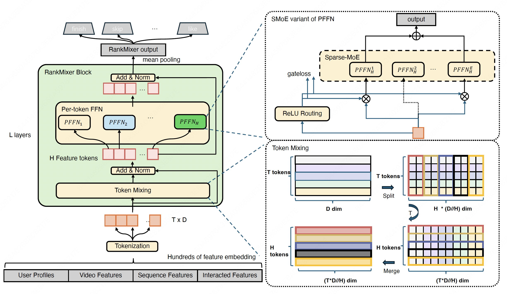
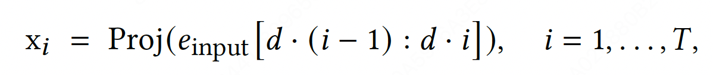
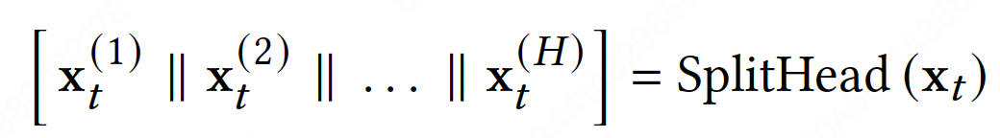
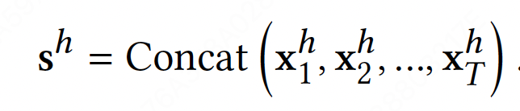
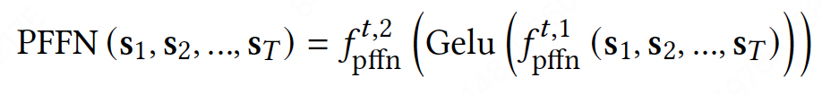
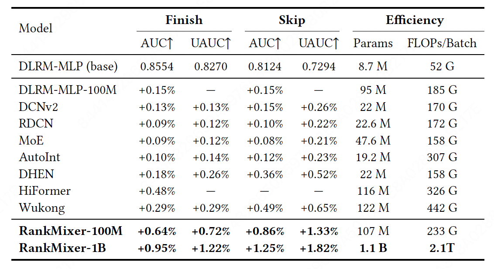
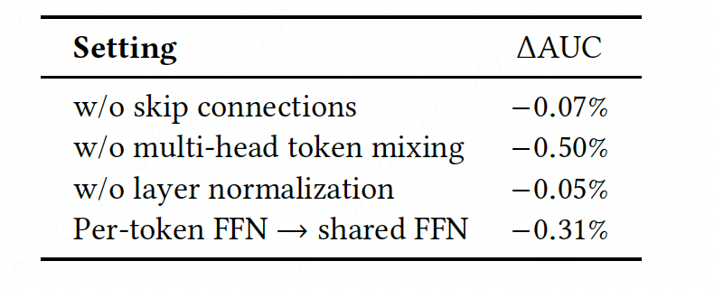
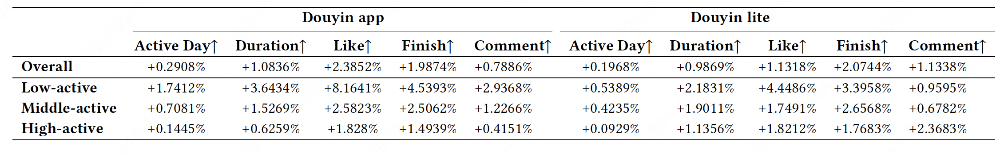
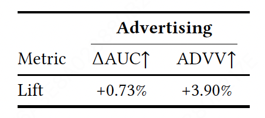
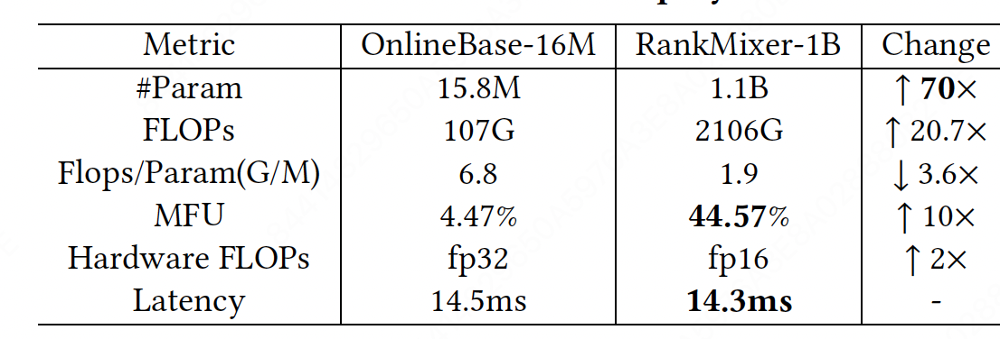

# RankMixer分享-20251205

论文链接：[https://dl.acm.org/doi/10.1145/3746252.3761507](https://dl.acm.org/doi/10.1145/3746252.3761507)

## 1背景
1. 工业界推荐系统的严格延时约束和高QPS需要  
2. 绝大多数排序模型的人工设计特征交叉模块都是CPU时代的产物（比如DeepFM，DCN等），对GPU利用率低，即低MFU(Model Flops Utilization，算力利用率)

## 2收益
### 业务收益  
全流量部署在抖音推荐系统for排序  
1. 用户在应用内活跃的天数相比之前提升了0.3%  
2. 用户在应用内的总使用时长提升了1.08%  

### 资源利用  
1. MFU从4.5%->45%  
2. 在推理时延不增加的情况下，模型参数量提升70倍，达到1B（Dense）  

## 3论点  
与transformer高度的并行计算能力，克服了基于特征交互的自注意力机制的一些限制：①低训练效率；②注意力权重矩阵运算带来的交叉空间ID相似度建模的组合爆炸以及苛刻的内存边界  

RankMixer在相同Flops下相比较Vanilla Transformer[^1] 的模型能力及学习能力更好  

## 4输入建模  
- 用户特征（User features）：用户ID、其他用户信息  
- 候选特征（candidate features）：video ID、作者ID等  
- 序列特征（Sequence Features）：行为序列，捕捉时空兴趣  
- 交叉特征（Cross Features）：用户和候选直接的交叉特征  

为了方便并行计算，各种维度的embedding被转换为维度对齐的向量，即feature-tokens（一个tokenization的过程）  

𝑒~input~是各个特征embedding向量拼接而成，d是每个token的固定特征维度，T是结果token的数量，Proj函数映射切分的embedding向量到D个维度，每个特征token表示一个相似的语义方面  

### 4.1 Multi-head token mixing  
通过parameter-free操作实现cross-token特征交互，性能和计算效率优于自注意力机制  

每个token x~t~被划分为H个头，这些头可以看作是标记x~𝑡~到低维特征子空间的投影，因为推荐是考虑不同角度的任务。Token Mixing用于融合这些子空间向量以进行全局特征交互。  

第h个token s~t~由第h个头对应的所有token拼接而成，如上述公式  

在RankMixer中，设置H=T，以便在Token Mixing后为残差连接保持相同数量的token。  

这一步取代了self-Attention操作，作者发现自注意力机制在推荐系统中是次优的。因为推荐系统不像LLM，所有token可以共享一个统一Embedding空间，推荐任务的特征空间天然是异构的。在两个异构的语义空间进行相似度内积计算是难以理解的，因为在推荐系统中，来自用户和项目端的特征的ID空间可能包含数亿个元素。因此，对这种不同的输入应用self-Attention并不优于无参数多头Token混合方法，并且自注意力消耗更多的计算、内存IO操作和GPU内存  

### 4.2 Per-token feed-forward networks (FFNs)  
之前的推荐模型在单个交互模块中混合来自许多不同语义空间的特性，这些因素可能导致高频领域占主导地位，忽视了低频或长尾信号，最终损害整体推荐质量  

作者引入per-token FFN，一个参数隔离的前馈网络架构。之前的FFN的参数共享交叉所有token，但是per-token FFN对每个token都专门处理转换，从而隔离每个token的参数。  

与参数全共享的FFN相比，per-token FFN通过引入更多的参数来增强建模能力，同时保持计算复杂度不变。  

值得强调的是，每个per-token FFN不同于MMoE 专家，因为每个per-token FFN看到一个不同的token输入，而MMoE中的所有专家共享相同的输入。  

不同于 MMoE（许多专家处理相同的输入），也不同于 Transformer（不同的输入共享一个FFN）， RankMixer 同时拆分输入和参数，这对于学习不同特征子空间中的多样性是很好的 。  

### 4.3 稀疏MoE  
为了进一步增加scaling ROI，使用Sparse Mixture-of-Experts (MoE)替代每个pretoken的密集FFNs，从而模型的容量增长而计算成本大致保持不变。  

但存在两个问题：①统一𝑘-expert路由。Top-𝑘选择对所有特征token一视同仁，在低信息token上浪费预算，这阻碍模型捕捉token之间的差异。②under-training专家。每个token的ffn已经将参数乘以\#token；增加非共享专家会进一步增加专家数量，产生高度不平衡的路由和训练不足的专家；  

提出了两种策略来解决：  

①ReLU Routing。为了赋予token灵活的专家计数并保持可微性，作者用 ReLU门加上自适应的L1惩罚取代了常见的Top𝑘+softmax  

②Dense-training / Sparse-inference (DTSI-MoE)。采用了两个路由器，分别是：h~train~和h~infer~，其中L~reg~[^2] 只应用于h~infer~。在训练过程中，h~train~和h~infer~都会被更新，而在推理过程中， 只用到h~infer~。事实证明，DS-MoE[^3] 使专家不会受到训练不足的困扰，同时降低了推理成本。  

## 4.4 实验对比  
UAUC[^4]  

消融实验  

在线实验对比：  

 

在线部署花销：  

## 5启发  
self-Attention结构在推荐任务中不一定是最优的特征交互方式  

## 6参考  
[https://zhuanlan.zhihu.com/p/1937436392402683166](https://zhuanlan.zhihu.com/p/1937436392402683166)  

[^1]: Vanilla Transformer：[https://zhuanlan.zhihu.com/p/402436755](https://zhuanlan.zhihu.com/p/402436755)  
[^2]: Lreg：稀疏度由Lreg控制 ，其系数为𝜆，保持平均活跃专家比例接近预算。  
[^3]: DS-MoE：Ads recommendation in a collapsed and entangled world.  
[^4]: UAUC：User-level AUC  
